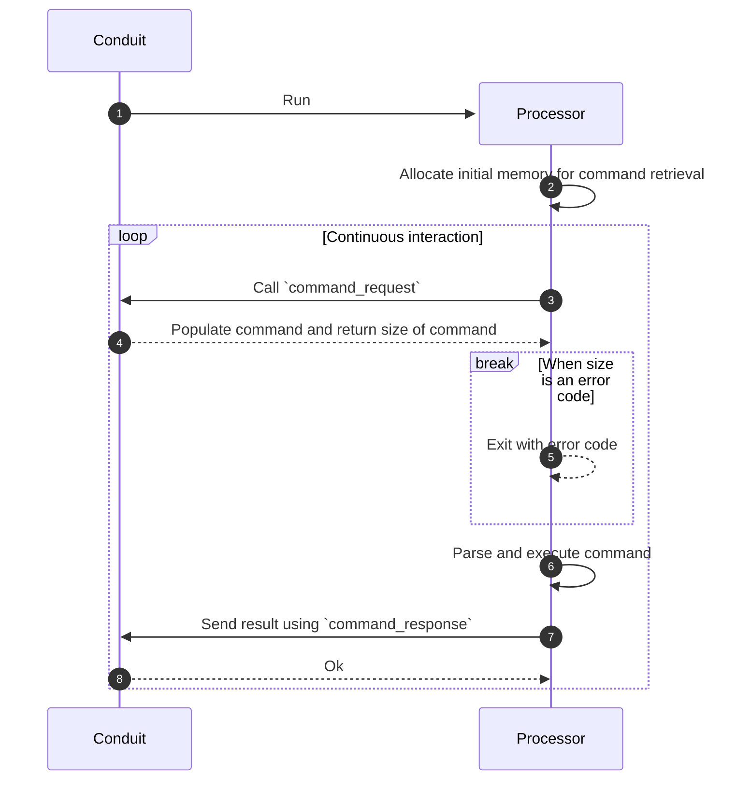

Here we will describe how Conduit runs standalone processors under the hood.
This is useful to understand when writing a processor SDK.

## WebAssembly

Conduit uses [WebAssembly](https://webassembly.org) (Wasm) to run standalone
processors. Wasm is a binary instruction format, designed as a portable target
for compilation of high-level languages like C/C++, Rust, Java and
[more](https://webassembly.org/getting-started/developers-guide/). Wasm binaries
are run using a Wasm runtime, in our case the [wazero](https://wazero.io)
runtime.

The main reason for using Wasm is to provide a secure and portable execution
environment for the processor. Wasm is designed to be run in a sandboxed
environment, which means that the processor cannot access the host system
directly. This is important to ensure that the processor cannot access or modify
the host system, and that it cannot access or modify other processors running in
the same environment.

### WASI support and limitations

Conduit uses [WASI](https://wasi.dev) (WebAssembly System Interface) to
provide a set of standard APIs that the processor can use to interact with the
host system. Since WASI is still a work in progress, we are currently using the
interface defined in [WASI preview 1](https://github.com/WebAssembly/WASI/blob/main/legacy/preview1/docs.md).

:::info

Because the processor has access to a limited set of system calls, it is not
possible to use all the features of the host system. For example, the processor
cannot access the file system, network, or any other system resource directly.

:::

## Processor lifecycle

A standalone processor is a plugin, compiled into a Wasm binary which interacts
with Conduit using two host functions: `command_request` and `command_response`.
The plugin is expected to continuously call these functions, allocate memory as
needed, parse commands, execute them, and respond back to the host.

Below is a sequence diagram that shows the high level interaction between Conduit
and a standalone processor.



1. The processor starts to run only when Conduit starts a pipeline containing a
   standalone processor. The lifetime of the processor is tied to the lifetime
   of the pipeline.
2. The processor allocates initial memory for command retrieval. This buffer
   should be reused for every command request. In case the buffer is too small,
   the processor should reallocate a larger buffer (see point 4).
3. The processor calls `command_request` to retrieve a command from Conduit.
   This call is blocking and will return when a command is available.
4. Conduit populates the allocated memory with a command and returns the size of
   the command or an error code. See [error codes](#error-codes) for more a list
   of possible error codes. See [`command_request`](#command_request) for more
   information about the command format.
5. In case Conduit returns an error code, the processor should exit with the
   error code.
6. The processor parses and executes the command. Note that everything except
   the actual command business logic can and should be implemented by a
   processor SDK.
7. The processor calls `command_response` to send the result back to Conduit.
   This call should happen even if the command execution failed (the result
   should include the error). See [`command_response`](#command_response)
   for more information about the response format.
8. Conduit acknowledges the result and the processor can continue retrieving
   the next command.

## Host functions

Conduit exposes a module named `conduit` with host functions, that allow the
processor to interact with Conduit.

Example host function import in Go:

```go
//go:wasmimport conduit command_request
func _commandRequest(ptr unsafe.Pointer, size uint32) uint32
```

All host functions accept two arguments:

1. A pointer to a memory address where Conduit can retrieve the request and/or
   write the result.
2. The size of the memory buffer.

All host functions return a single integer which indicates the size of the
response or an error code. See [error codes](#error-codes) for a list of
possible error codes. If the host function returns 0 it indicates success. If
the returned integer is an error code, the processor should exit immediately.

The data in the memory buffer is always serialized using
[Protocol Buffers](https://protobuf.dev). The schema for the data can be found
in the [Buf schema registry](https://buf.build/conduitio/conduit-processor-sdk/docs/main:processor.v1).

### `command_request`

The processor should call this function to retrieve a command request from
Conduit. The function is blocking and will return only when a command is
available. The returned integer represents the size of the command, or an
[error code](#error-codes). If the allocated memory buffer is smaller than the
returned command size, the processor should reallocate a larger buffer and call
`command_request` again.

Conduit will populate the memory buffer with a
[`CommandRequest`](https://buf.build/conduitio/conduit-processor-sdk/docs/main:processor.v1#processor.v1.CommandRequest),
which can contain one of the following commands:

- [`Specify.Request`](https://buf.build/conduitio/conduit-processor-sdk/docs/main:processor.v1#processor.v1.Specify.Request) -
  The processor should return its specifications by calling
  [`command_response`](#command_response) with a
  [`Specify.Response`](https://buf.build/conduitio/conduit-processor-sdk/docs/main:processor.v1#processor.v1.Specify.Response).
- [`Configure.Request`](https://buf.build/conduitio/conduit-processor-sdk/docs/main:processor.v1#processor.v1.Configure.Request) -
  Conduit passes the configuration to the processor which should be parsed and
  stored. The processor should respond with a
  [`Configure.Response`](https://buf.build/conduitio/conduit-processor-sdk/docs/main:processor.v1#processor.v1.Configure.Response).
- [`Open.Request`](https://buf.build/conduitio/conduit-processor-sdk/docs/main:processor.v1#processor.v1.Open.Request) -
  The processor should initialize its state and respond with an
  [`Open.Response`](https://buf.build/conduitio/conduit-processor-sdk/docs/main:processor.v1#processor.v1.Open.Response).
- [`Process.Request`](https://buf.build/conduitio/conduit-processor-sdk/docs/main:processor.v1#processor.v1.Process.Request) -
  The processor should process the records in the request and return the result
  using a
  [`Process.Response`](https://buf.build/conduitio/conduit-processor-sdk/docs/main:processor.v1#processor.v1.Process.Response).
- [`Teardown.Request`](https://buf.build/conduitio/conduit-processor-sdk/docs/main:processor.v1#processor.v1.Teardown.Request) -
  The processor should clean up its state, close any open resources and respond
  with a
  [`Teardown.Response`](https://buf.build/conduitio/conduit-processor-sdk/docs/main:processor.v1#processor.v1.Teardown.Response).
  The plugin can expect that the next command after a `Teardown.Request` will be
  an error code indicating no more commands.

### `command_response`

The processor should call this function to send a
[`CommandResponse`](https://buf.build/conduitio/conduit-processor-sdk/docs/main:processor.v1#processor.v1.CommandResponse) back to Conduit. The function returns 0 if
the response was successfully received, or an [error code](#error-codes).

The memory address sent to `command_response` should contain a
[`CommandResponse`](https://buf.build/conduitio/conduit-processor-sdk/docs/main:processor.v1#processor.v1.CommandResponse):

- [`Specify.Response`](https://buf.build/conduitio/conduit-processor-sdk/docs/main:processor.v1#processor.v1.Specify.Response)
  should be sent in response to a
  [`Specify.Request`](https://buf.build/conduitio/conduit-processor-sdk/docs/main:processor.v1#processor.v1.Specify.Request).
- [`Configure.Response`](https://buf.build/conduitio/conduit-processor-sdk/docs/main:processor.v1#processor.v1.Configure.Response)
  should be sent in response to a
  [`Configure.Request`](https://buf.build/conduitio/conduit-processor-sdk/docs/main:processor.v1#processor.v1.Configure.Request).
- [`Open.Response`](https://buf.build/conduitio/conduit-processor-sdk/docs/main:processor.v1#processor.v1.Open.Response)
  should be sent in response to a
  [`Open.Request`](https://buf.build/conduitio/conduit-processor-sdk/docs/main:processor.v1#processor.v1.Open.Request).
- [`Process.Response`](https://buf.build/conduitio/conduit-processor-sdk/docs/main:processor.v1#processor.v1.Process.Response)
  should be sent in response to a
  [`Process.Request`](https://buf.build/conduitio/conduit-processor-sdk/docs/main:processor.v1#processor.v1.Process.Request).
- [`Teardown.Response`](https://buf.build/conduitio/conduit-processor-sdk/docs/main:processor.v1#processor.v1.Teardown.Response)
  should be sent in response to a
  [`Teardown.Request`](https://buf.build/conduitio/conduit-processor-sdk/docs/main:processor.v1#processor.v1.Teardown.Request).
- [`Error`](https://buf.build/conduitio/conduit-processor-sdk/docs/main:processor.v1#processor.v1.Error)
  should be sent in response to any command request that failed to be processed.

### `create_schema`

The processor should call this function to create a new Schema in the schema registry.
The memory address sent to `create_schema` should contain a [`CreateSchemaRequest`](https://buf.build/conduitio/conduit-processor-sdk/docs/main:procutils.v1#procutils.v1.CreateSchemaRequest),
then Conduit will populate the memory buffer with a [`CreateSchemaResponse`](https://buf.build/conduitio/conduit-processor-sdk/docs/main:procutils.v1#procutils.v1.CreateSchemaResponse).

The returned integer represents the size of the response if the request was successful.
If the allocated memory buffer is smaller than the returned response size, the processor
should reallocate a larger buffer and call `create_schema` again.
If the schema creation failed, an [error code](#error-codes) will be returned instead.

### `get_schema`

The processor should call this function to get a Schema from the schema registry.
The memory address sent to `get_schema` should contain a [`GetSchemaRequest`](https://buf.build/conduitio/conduit-processor-sdk/docs/main:procutils.v1#procutils.v1.GetSchemaRequest),
then Conduit will populate the memory buffer with a [`GetSchemaResponse`](https://buf.build/conduitio/conduit-processor-sdk/docs/main:procutils.v1#procutils.v1.GetSchemaResponse).

The returned integer represents the size of the response if the request was successful.
If the allocated memory buffer is smaller than the returned response size, the processor
should reallocate a larger buffer and call `get_schema` again.
If getting the schema fails, an [error code](#error-codes) will be returned instead.

## Error codes

The last 100 numbers at the end of an `uin32` (between 4,294,967,195 and
4,294,967,294) are reserved for error codes. If one of the host functions returns
a number in this range it represents an error code and the plugin should stop
running.

**Current error codes:**

- `4,294,967,294` - no more commands. Returned by `command_request` when Conduit
  has no more commands to return and the plugin should gracefully stop running
  (exit code 0).
- `4,294,967,293` - unknown command request. Internal error in Conduit, where
  the command request failed to be marshaled into a proto message.
- `4,294,967,292` - unknown command response. Internal error in Conduit, where
  the command response failed to be unmarshalled from the proto message into a
  struct.
- `4,294,967,291` - memory out of range. Internal error in Conduit, where it
  tried to write into the allocated memory, but failed to do so, as the size was
  insufficient.
- `4,294,967,290` - Internal error in Conduit, could be an error while 
  marshalling/unmarshalling the buffer, or other reasons, the specific
  error should be logged by Conduit.
- `4,294,967,289` - Subject not found, an internal Conduit error where 
  the Schema with this subject does not exist.
- `4,294,967,288` - Version not found, an internal Conduit error where
  the Schema with this Version does not exist.
- `4,294,967,287` - Invalid schema, an internal Conduit error where
  the Schema provided is invalid.

## Logging

The processor can log messages to `stderr` and `stdout` and they will show up in
the Conduit logs. Even though no specific format is enforced, it is recommended
to emit logs in a JSON format, as Conduit will be able to parse and display them
in a more readable way.

There are a few standard fields that should be included in every log message:

- `level` - The log level, one of `trace`, `debug`, `info`, `warn`, `error`. If
  the log level is not specified, the message will be logged without a level.
- `message` - The log message.

Conduit will automatically add the following fields to all messages:

- `time` - Will contain the time when the log was emitted.
- `processor_id` - The unique identifier of the processor entity in Conduit
  associated with this plugin instance.

Example log message emitted by the plugin:

```json
{
  "level": "info",
  "contextual-info": "some contextual info",
  "message": "Processor is running"
}
```

:::tip

Please be mindful of the log level you use. Processors are executed in the
hot-path of the data processing pipeline and excessive logging can have a
negative impact on the performance of the pipeline.

Also make sure you respect the log level set by Conduit in the environment
variable `CONDUIT_LOG_LEVEL` to reduce unnecessary verbosity.

:::

## Environment variables

When Conduit starts the processor, it will set the following environment
variables:

- `CONDUIT_LOG_LEVEL` indicates the log level that the processor should use.
  This is useful to control the verbosity of the logs emitted by the processor.
  The log level can be one of `trace`, `debug`, `info`, `warn`, `error`.
- `CONDUIT_PROCESSOR_ID` is the unique identifier of the processor entity in
  Conduit associated with this plugin instance. Note that Conduit will
  automatically add this ID to log messages emmitted by the plugin, so you don't
  have to attach it manually.

